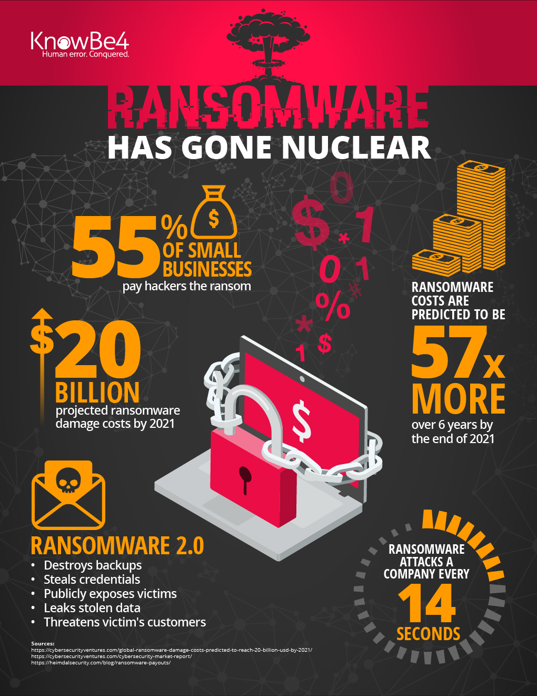
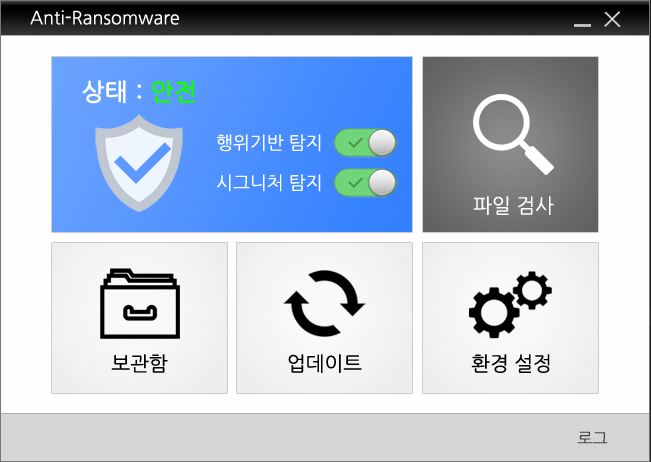
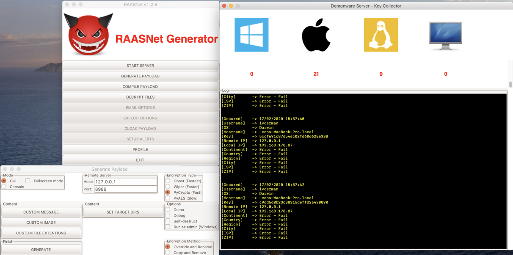

## introduction 
Ransomware Simulator for Blue team ,Ransomware Simulator for Red team ,Ransomware infographic, open source Anti Ransomware, Ransomware As A Service and Ransomware protection technologies

  

## Ransomware infographic

  

## Ransomware Simulator for Blue team
Ransomware Simulator for testing Blue Team Detections and to tune their sensors.

* [Ransim](https://github.com/d4rk-d4nph3/Ransim)

## Ransomware Simulator for Red team
Jasmin Ransomware is an advanced red team tool (WannaCry Clone) used for simulating real ransomware attacks. Jasmin helps security researchers to overcome the risk of external attacks.

* [Jasmin The Ransomware](https://github.com/codesiddhant/Jasmin-Ransomware)

  

## open source Anti Ransomware
open source anti ransomware with File System Minifilter Driver Mechanism.

* [Anti-Ransomware](https://github.com/clavis0x/AntiRansomware)

  

## Ransomware As A Service
Open-Source Ransomware As A Service for Linux, MacOS and Windows

* [RAASNet](https://github.com/leonv024/RAASNet)

  

## Ransomware protection technologies
* behavioral detection
* cloud analysis
* expert analysis
* automatic analysis

